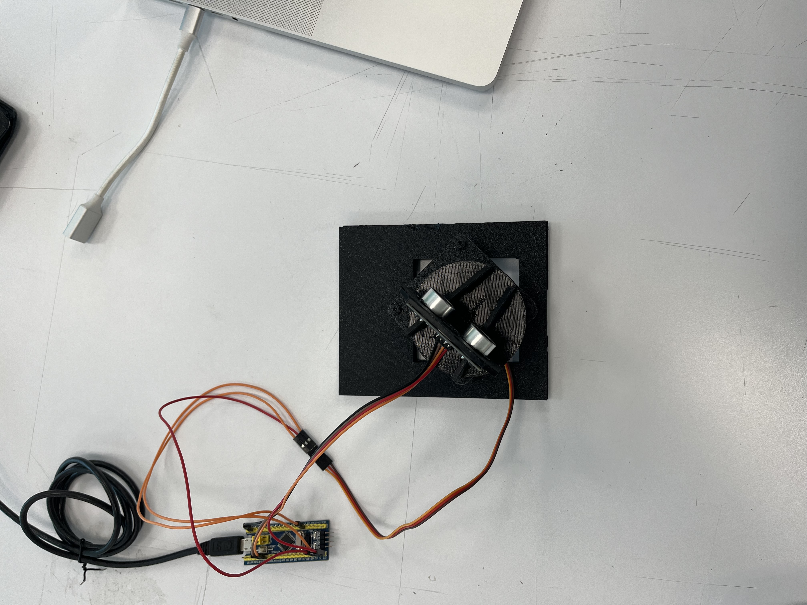
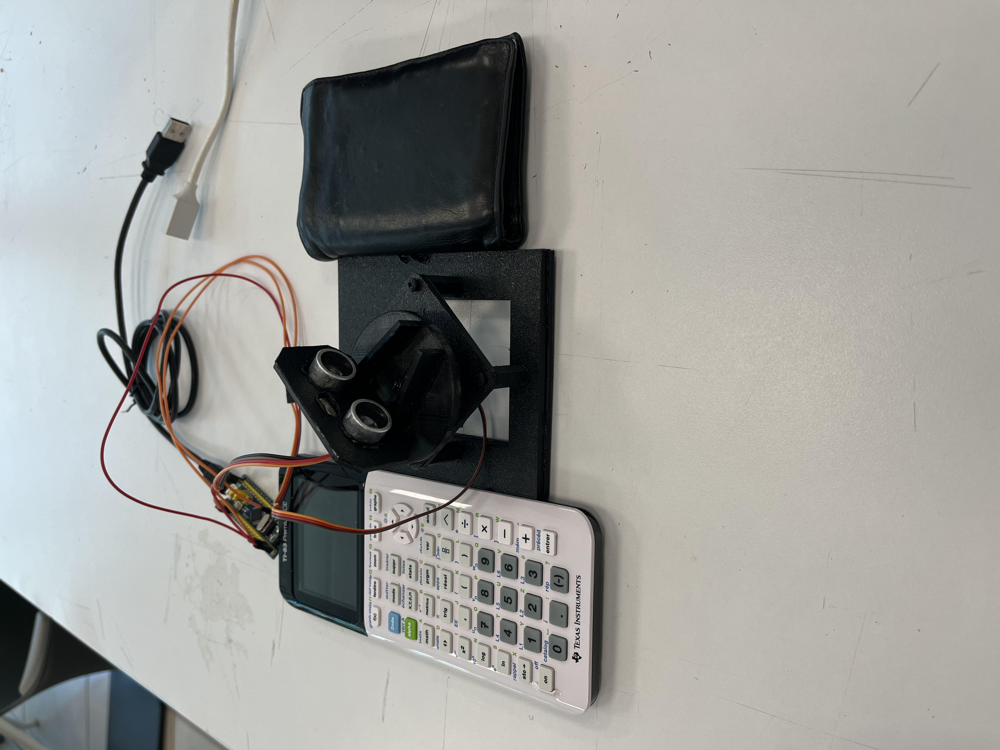
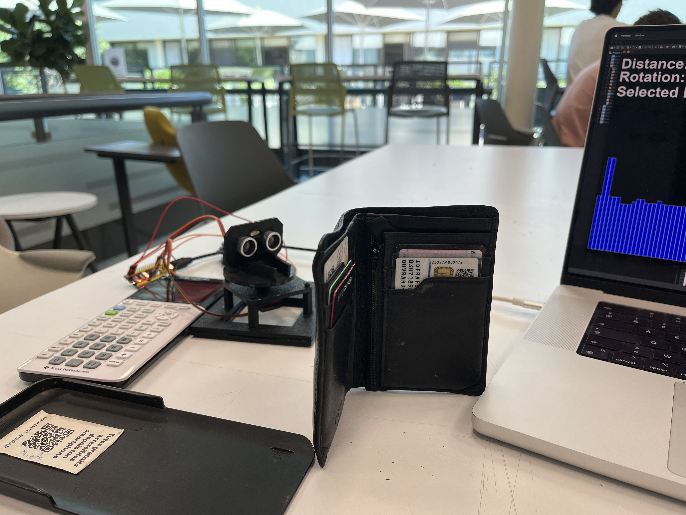
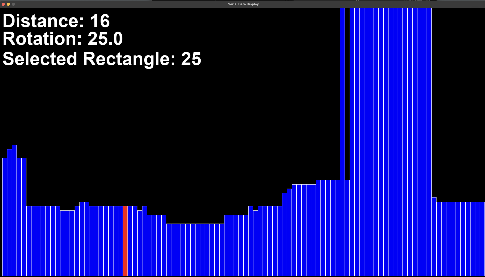

# Ultrasonic Radar System


## Overview

This project implements an ultrasonic radar system using a STM32F103C8T6 microcontroller (Blue Pill), an HC-SR04 ultrasonic distance sensor, and an MG-90S servo motor. The system scans the environment by rotating the ultrasonic sensor and measuring distances at different angles to create a radar-like visualization.

## Hardware Components

- **STM32F103C8T6 (Blue Pill)**: Main microcontroller board
- **HC-SR04**: Ultrasonic distance sensor
- **MG-90S**: Servo motor for rotation
- **Jumper wires**
- **Breadboard**

## Images

Top view of the setup:


It's too light, need to put the setup between two books for stability.


Usage example:



## Pin Connections

| Component | Pin on Component | Pin on STM32F103 |
|-----------|------------------|------------------|
| HC-SR04   | VCC              | 5V               |
| HC-SR04   | GND              | GND              |
| HC-SR04   | TRIG             | PA9              |
| HC-SR04   | ECHO             | PA8              |
| MG-90S    | PWM (Orange)     | PA1 (TIM2_CH1)   |
| MG-90S    | VCC (Red)        | 5V               |
| MG-90S    | GND (Brown)      | GND              |

## Physical Setup


1. Mount the MG-90S servo on a stable platform
2. Attach the HC-SR04 sensor to the servo arm (we used a 3D-printed holder)
3. Connect all components according to the pin connections table
4. Ensure the servo can rotate freely without cable interference

## Software

### Prerequisites

- STM32CubeIDE
- STM32 HAL libraries
- Micro-USB cable for programming and communication

### Key Features

- Servo motor control with PWM using Timer2
- HC-SR04 distance measurement with microsecond timing
- Scanning in a 180-degree arc
- Distance measurement at various angles
- USB communication, sending angle and distance data to a PC
- Visualization of data using Python with Pygame

## Implementation Details

### HC-SR04 Interface

The HC-SR04 sensor operates by sending an ultrasonic pulse and measuring the time it takes for the echo to return. The distance is calculated using the formula:

```
Distance (cm) = (Echo Pulse Duration (μs) * Speed of Sound (343 m/s)) / 2 / 10000
```


### Servo Control

The MG-90S servo is controlled using PWM with pulse widths between 500μs (0°) and 2500μs (180°). We use the STM32's Timer2 in PWM mode to generate these pulses.

## Visualization

To run the visualization, you need to install Python and Pygame. The data is sent over USB in the following format:

```html
<distance>,<angle>\r\n
```

Run the Python script to visualize the radar data:

```bash
python radar.py
```
The radar visualization will show the distance measurements at different angles, creating a radar-like effect.

### Example Output



## Credits

- STM32 HAL Library by ST Microelectronics
- HC-SR04 timing diagram adapted from the device datasheet
- Project inspired by various radar projects in the maker community

